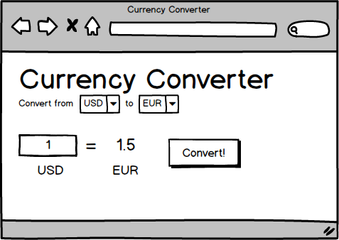

# Currency Converter using Ajax

In this project, you will use JavaScript and Ajax (using the `fetch()` function) to communicate with [the Open Exchange Rates API](https://openexchangerates.org/) in order to convert an amount of currency to another type of currency.

A user should be able to enter an amount in US dollars (USD) and choose a currency to convert that amount to. When they click the "convert" button, the page should show the result of converting that amount to the selected currency.

A mockup is provided below -- yours can look different!

## How to do it

To do this, you'll need three tools:

- DOM manipulation
- Event listeners
- AJAX requests (using fetch)

You will need a dropdown list of currencies from which your user can choose their desired target currency. You can code this directly in your HTML or build this via JavaScript when the page loads (there is a list of currencies available through this API in this repo in the currencies.js file, but you can also request the list from the API).

When someone clicks the convert button, you will want to:

- read the base and target currencies from their dropdowns
- read the currency amount from its form field
- make a fetch request to `https://openexchangerates.org/api/latest.json?app_id=APP_ID&base=BASE_CURRENCY` where `BASE_CURRENCY` is a placeholder for the base currency code and `APP_ID` is a placeholder for an access key to use this api. You can get one by creating a free account on openexchangerates.org (see resources below).
- use the data from the fetch request to calculate the target currency amount
- update the page to show that amount

There are other events you should listen for: you will want to update the user interface whenever someone chooses a currency or changes the amount of currency they are converting.

## 🌶 Spicy Options

- Add in information about the country and name for each currency so that your application is easier to use.
- Can you find a way to add a country flag for each one?

## Resources

- [Open Exchange Rates Free Plan SignUp](https://openexchangerates.org/signup/free)
- [Open Exchange Rates Account Page with AppId](https://openexchangerates.org/account/app-ids)
- [Open Exhange Rates API Docs](https://docs.openexchangerates.org/docs)
